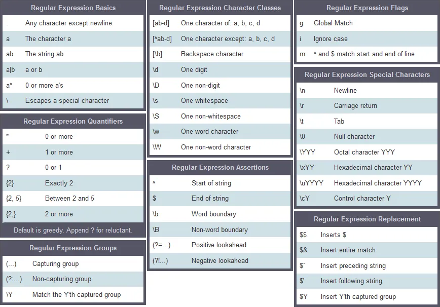

# **Módulo 4: Strings**

En este módulo, aprenderás a manipular y trabajar con cadenas de texto en Java utilizando `String`, `StringBuilder`, y `StringBuffer`. También se introducirá el uso de **expresiones regulares** para validar y trabajar con patrones en cadenas.

---

## **1. Strings**

Un `String` en Java es un objeto que representa una secuencia de caracteres. Son **inmutables**, lo que significa que no pueden ser modificadas una vez creadas. Todas las operaciones que parecen modificar una cadena, en realidad, crean un nuevo objeto.

### **1.1 Declaración e inicialización de Strings**

#### **Declarar un String:**
```java
String texto; // Declaración de un String
```

#### **Inicializar un String:**
```java
String texto = "Hola Mundo"; // Inicialización directa
String texto2 = new String("Hola Mundo"); // Inicialización usando el constructor
```

### **1.2 Métodos comunes de la clase String**

| **Método**               | **Descripción**                                                                               | **Ejemplo**                                       |
|--------------------------|-----------------------------------------------------------------------------------------------|-------------------------------------------------|
| `length()`               | Devuelve la longitud de la cadena.                                                            | `"Hola".length()` → `4`                         |
| `substring(inicio, fin)` | Extrae una subcadena desde el índice `inicio` hasta `fin` (sin incluir `fin`).                | `"Hola".substring(1, 3)` → `"ol"`               |
| `equals(cadena)`         | Compara el contenido de dos cadenas.                                                         | `"Hola".equals("hola")` → `false`               |
| `equalsIgnoreCase(cadena)`| Compara cadenas ignorando mayúsculas/minúsculas.                                             | `"Hola".equalsIgnoreCase("hola")` → `true`      |
| `toLowerCase()` / `toUpperCase()` | Convierte la cadena a minúsculas o mayúsculas.                                         | `"Hola".toUpperCase()` → `"HOLA"`               |
| `indexOf(caracter)`      | Devuelve el índice de la primera aparición de un carácter.                                    | `"Hola".indexOf('o')` → `1`                     |
| `charAt(indice)`                 | Devuelve el carácter en la posición especificada por `indice`.                                    | `"Hola".charAt(1)` → `'o'`                     |
| `lastIndexOf(caracter)`  | Devuelve el índice de la última aparición de un carácter.                                     | `"Hola".lastIndexOf('o')` → `1`                 |
| `replace(viejo, nuevo)`  | Reemplaza todas las apariciones de un carácter o subcadena por otra.                         | `"Hola".replace('o', '*')` → `"H*la"`           |
| `trim()`                 | Elimina espacios en blanco al inicio y final de la cadena.                                   | `" Hola ".trim()` → `"Hola"`                    |


### **Ejercicios**

1. **Contar caracteres:**
   - Escribe un programa que solicite al usuario una frase y cuente su longitud usando `length()`.

2. **Extraer una palabra:**
   - Usa `substring` para extraer el nombre de una cadena que contiene un nombre completo.

3. **Reemplazar caracteres:**
   - Crea un programa que reemplace todas las vocales de una cadena por un carácter ingresado por el usuario.

---

## **2. StringBuilder y StringBuffer**

Los objetos `StringBuilder` y `StringBuffer` son **mutables**, lo que significa que puedes modificar su contenido directamente.

### **2.1 Declaración e inicialización**

#### **Declarar un StringBuilder o StringBuffer:**
```java
StringBuilder sb = new StringBuilder("Hola");
StringBuffer sbf = new StringBuffer("Hola");
```

### **2.2 Métodos comunes de StringBuilder y StringBuffer**

#### **Métodos más comunes:**

| **Método**             | **Descripción**                                                                                 | **Ejemplo**                                |
|------------------------|-------------------------------------------------------------------------------------------------|-------------------------------------------|
| `append(cadena)`       | Agrega texto al final del objeto.                                                                | `"Hola".append(" Mundo") → "Hola Mundo"`  |
| `insert(pos, cad)`     | Inserta texto en una posición específica.                                                       | `"Hola".insert(4, "!") → "Hola!"`         |
| `delete(inicio, fin)`  | Elimina caracteres entre los índices `inicio` y `fin`.                                           | `"Hola".delete(0, 2) → "la"`              |
| `reverse()`            | Invierte el contenido del texto.                                                                 | `"Hola".reverse() → "aloH"`               |
| `replace(inicio, fin, cadena)` | Reemplaza los caracteres entre `inicio` y `fin` por una nueva cadena.                       | `"Hola".replace(0, 2, "Hey") → "Heya"`    |
| `toString()`           | Convierte el `StringBuilder` o `StringBuffer` en un `String`.                                    | `new StringBuilder("Hola").toString() → "Hola"` |

---

#### **Métodos menos comunes:**

| **Método**             | **Descripción**                                                                                 | **Ejemplo**                                    |
|------------------------|-------------------------------------------------------------------------------------------------|-----------------------------------------------|
| `setLength(longitud)`  | Establece la longitud de la cadena. Si es mayor, añade espacios, si es menor, trunca el texto.   | `"Hola".setLength(10)` → `"Hola     "`        |
| `capacity()`           | Devuelve la capacidad total de almacenamiento del `StringBuilder` o `StringBuffer`.             | `new StringBuilder("Hola").capacity() → 16`   |
| `ensureCapacity(capacidad)` | Asegura que el `StringBuilder` o `StringBuffer` tenga suficiente capacidad para un tamaño mínimo. | `sb.ensureCapacity(100)`                       |
| `substring(inicio)`    | Devuelve la subcadena a partir del índice `inicio` hasta el final de la cadena.                  | `"Hola Mundo".substring(5) → "Mundo"`         |
| `charAt(indice)`       | Devuelve el carácter en el índice especificado.                                                  | `"Hola".charAt(1) → 'o'`                      |
| `deleteCharAt(indice)` | Elimina el carácter en la posición especificada.                                                 | `"Hola".deleteCharAt(0) → "ola"`              |


### **Ejercicios**

1. **Crear una oración dinámica:**
   - Solicita palabras al usuario y usa `append` para construir una oración.

2. **Eliminar caracteres:**
   - Usa `delete` para eliminar los caracteres centrales de una cadena ingresada.

3. **Añadir texto:**
   - Crea un programa que pida al usuario un texto y lo agregue al final de una cadena utilizando `append()`. Luego imprime la cadena completa.

4. **Eliminar caracteres:**
   - Pide al usuario un texto y elimina los primeros dos caracteres.

5. **Invertir una cadena:**
   - Escribe un programa que reciba una cadena de texto y la invierta.

---

## **3 Parseo de Tipado: String a StringBuffer y viceversa**

En Java, **`String`** y **`StringBuffer`** son dos tipos de objetos relacionados con la manipulación de cadenas, pero tienen diferencias fundamentales en su comportamiento. **`String`** es inmutable (no se puede modificar una vez creado), mientras que **`StringBuffer`** es mutable (puede ser modificado). Por lo tanto, si se necesita convertir de uno a otro, se debe hacer un **parseo** o **conversión** explícita.

### **3.1 Diferencias entre String y StringBuffer**
- **`String`**:
  - Es **inmutable**, lo que significa que cualquier operación que modifique una cadena crea un nuevo objeto de tipo `String`.
  - Es adecuado cuando no se espera modificar el contenido de la cadena.
  
- **`StringBuffer`**:
  - Es **mutable**, lo que significa que sus contenidos pueden ser modificados sin crear nuevos objetos.
  - Es más eficiente que `String` cuando se realizan muchas modificaciones en una cadena (por ejemplo, agregar o modificar caracteres).
  

### **3.2 Conversión de StringBuffer a String**

Aunque **`StringBuffer`** es mutable y **`String`** es inmutable, a menudo es necesario convertir entre estos tipos. La forma más común de convertir un `StringBuffer` a un `String` es utilizando el método **`toString()`** de `StringBuffer`.

#### **Ejemplo: Convertir StringBuffer a String**

```java
StringBuffer stb = new StringBuffer("Hola Mundo");
String texto = stb.toString(); // Convertir StringBuffer a String
System.out.println(texto); // Salida: Hola Mundo
```

- En este ejemplo, creamos un `StringBuffer` con el texto `"Hola Mundo"`.
- Luego, usamos el método `toString()` para convertirlo en un objeto `String`.
- Esto se necesita porque, aunque ambas clases representan una secuencia de caracteres, **`StringBuffer`** es mutable, mientras que **`String`** es inmutable. Como resultado, no podemos asignar directamente un `StringBuffer` a una variable de tipo `String`.

### **3.3 Conversión de String a StringBuffer**

De forma similar, si necesitamos convertir un **`String`** a un **`StringBuffer`**, podemos hacerlo utilizando el constructor de `StringBuffer` que acepta un `String` como argumento.

#### **Ejemplo: Convertir String a StringBuffer**

```java
String texto = "Hola Mundo";
StringBuffer stb = new StringBuffer(texto); // Convertir String a StringBuffer
System.out.println(stb); // Salida: Hola Mundo
```

- En este ejemplo, creamos un `String` con el texto `"Hola Mundo"`.
- Luego, lo pasamos al constructor de `StringBuffer`, que convierte el `String` en un objeto `StringBuffer`.
- A partir de ahí, puedes modificar el contenido del `StringBuffer` si es necesario (por ejemplo, usando `append()`, `insert()`, etc.).

### **3.4 ¿Por qué hacer la conversión?**

- La **conversión de `StringBuffer` a `String`** es útil cuando se necesita un objeto **inmutable** (por ejemplo, para almacenar o pasar una cadena que no debe modificarse).
- La **conversión de `String` a `StringBuffer`** es útil cuando se planean **modificaciones** frecuentes en la cadena (por ejemplo, agregar, insertar o eliminar caracteres).

La conversión entre estos dos tipos se realiza comúnmente en situaciones donde el tipo de cadena se adapta mejor a un caso específico, como cuando se manejan grandes cantidades de texto que se modifican con frecuencia (`StringBuffer`), pero luego se necesita usar la cadena en su forma final e inmutable (`String`).

### **Ejercicios**

1. **Convertir y modificar cadenas**:
   - Crea un programa que haga lo siguiente:
     1. Pide al usuario que ingrese una cadena.
     2. Convierte la cadena a un `StringBuffer`.
     3. Agrega el texto `" - Modificado"` al final de la cadena.
     4. Convierte el `StringBuffer` de nuevo a un `String` y muestra el resultado final.

2. **Cambiar palabras**:
   - Crea un programa que:
     1. Reciba una cadena de texto como `String`.
     2. La convierta en un `StringBuffer`.
     3. Reemplaza todas las palabras `"Java"` por `"Python"`.
     4. Convierte el `StringBuffer` de nuevo a un `String` y muestra la nueva cadena.

3. **StringBuffer y String**:
   - Crea un programa que:
     1. Declare un `StringBuffer` con el texto `"Hola Mundo"`.
     2. Lo convierta a un `String`.
     3. Imprima el `String` y también imprima su longitud.

---
## **4. Expresiones Regulares**

Las expresiones regulares nos permiten validar o buscar patrones en cadenas. En Java, se utilizan con el método `matches`.



### **Ejemplo: Validar correo electrónico**
```java
String correo = "usuario@dominio.com";
boolean esValido = correo.matches("[a-zA-Z0-9._%+-]+@[a-zA-Z0-9.-]+\\.[a-zA-Z]{2,}");
System.out.println("Correo válido: " + esValido);
```

### **Ejercicios**

1. **Validar un número de teléfono:**
   - Verifica que el formato sea `123456789`.

2. **Comprobar formato de fecha:**
   - Valida si una fecha cumple con el formato `dd/mm/aaaa`.

3. **Censurar palabras prohibidas:**
   - Reemplaza palabras específicas en un texto ingresado por el usuario.


## **Ejercicios Prácticos**

### **Nivel Bajo**

1. **Contar la longitud de una cadena:**
   - Pide al usuario que ingrese una cadena de texto y cuenta cuántos caracteres tiene la cadena.
   - Muestra el resultado en pantalla.

2. **Extraer una subcadena:**
   - Crea un programa que reciba una cadena de texto.
   - Extrae los primeros 5 caracteres de la cadena y muestra la subcadena obtenida.

3. **Convertir a mayúsculas:**
   - Solicita al usuario que ingrese una frase.
   - Convierte toda la frase a mayúsculas y muestra la frase convertida.


### **Nivel Intermedio**

1. **Buscar una palabra en una frase:**
   - Pide al usuario que ingrese una frase.
   - Busca la primera aparición de una palabra específica en la frase.
   - Si la palabra está presente, imprime su índice. Si no, muestra un mensaje indicando que la palabra no se encuentra.

2. **Reemplazar caracteres:**
   - Pide al usuario que ingrese una cadena de texto.
   - Reemplaza todas las vocales en la cadena por el carácter `*`.
   - Imprime la cadena resultante.

3. **Reemplazar la primera palabra:**
   - Pide al usuario que ingrese una frase.
   - Extrae la primera palabra de la frase y reemplázala por una nueva palabra proporcionada por el usuario.
   - Muestra la frase modificada.


### **Nivel Alto**

1. **Validación de correo electrónico:**
   - Crea un programa que reciba un correo electrónico ingresado por el usuario y lo valide.
   - Si el correo es válido, imprime un mensaje de éxito. Si no es válido, muestra un mensaje de error.

2. **Reemplazar todas las letras 'a' por 'z':**
   - Pide al usuario que ingrese una cadena de texto.
   - Reemplaza todas las letras `a` en la cadena por la letra `z`.
   - Muestra la cadena modificada.

3. **Generar un texto dinámico con StringBuilder:**
   - Crea un programa que construya una oración de manera dinámica.
   - Pide al usuario que ingrese una serie de palabras (por ejemplo, nombre, verbo, lugar) y agrega estas palabras a la oración.
   - Al final, imprime la oración resultante.